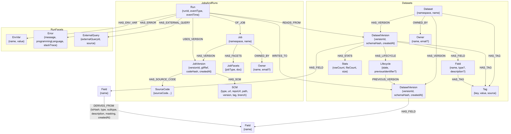

<div align="center">
  
</div>

## Lineagentic-flow

Lineagentic-flow is an agentic ai solution for building end-to-end data lineage across diverse types of data processing scripts across different platforms. It is designed to be modular and customizable, and can be extended to support new data processing script types.

### Features

- Plugin based architecture, simple to extend and customize.
- Interactive web based lineage visualizer engine.
- Command line interface for quick analysis.
- Rest API for integration with other systems.
- Support for multiple data processing script types (SQL, Python, Airflow, etc.)
- Support Neo4j and generic graph data model for lineage data storage.
- Support Mysql for operation tracing.


## Agent Status Table

Following table shows the current development agents in Lineagentic-flow algorithm:


| **Agent Name**       | **Done** | **Under Development** | **In Backlog** | **Comment**                          |
|----------------------|:--------:|:----------------------:|:--------------:|--------------------------------------|
| python-lineage_agent    | ✓        |                        |                |       |
| airflow_lineage_agent       |    ✓        |                      |                |             |
| java_lineage_agent      |       ✓     |                        |              |           |
| spark_lineage_agent        |  ✓          |                       |                |       |
| sql_lineage_agent      | ✓        |                        |                |            |
| flink_lineage_agent         |          |                        | ✓              |            |
| beam_lineage_agent         |          |                        | ✓              |            |
| shell_lineage_agent         |          |                        | ✓              |            |
| scala_lineage_agent         |          |                        | ✓              |            |
| dbt_lineage_agent         |          |                        | ✓              |            |


### What are the components of Lineagentic-flow?

- Algorithm module: This is the brain of the Lineagentic. It contains agents, which are implemented as plugins and acting as chain of thought process to extract lineage from different types of data processing scripts. The module is built using a plugin-based design pattern, allowing you to easily develop and integrate your own custom agents. Once added to the algorithm module, all other components of the platform will be available to support your agents

- Backend module: This module provides a REST API interface around the Algorithm Module. It contains generic graph model with can be extended to support new data models. It exposes several REST endpoints, each tailored to specific tasks. Depending on the job requested, different agents within the Algorithm Module are activated accordingly.  Also through GET APIs you can get the lineage data from the graph model. The backend module also contains a mysql database for operation tracing.

- Lineage visualizer module:  This module provides a web-based interface for visualizing lineage data generated by various agents. Depend on your use-case:
      1- You can use this module as main visualizer engine which is based on JSONCrack.
      2- You can use this module as a playground to test and visualize your agents.
      3- or you can read data from Neo4j graph model to visualize there or you can use your own visualization engine. 

- CLI module: is for command line around algorithm API and connect to unified service layer

- Demo module: is for teams who want to demo Lineagentic-flow in fast and simple way deployable into huggingface spaces.


### Activation and Deployment

To simplify the usage of Lineagentic-flow, a Makefile has been created to manage various activation and deployment tasks. You can explore the available targets directly within the Makefile. Here you can find different strategies but for more details look into Makefile.

1- to start the services:

```bash
make start-all-services
```
2- to stop the services:

```bash
make stop-all-services
```
3- to start the services and clean database data:

```bash
make start-all-services-and-clean-data
```

4- In order to deploy Lineagentic-flow to Hugging Face Spaces, run the following command ( you need to have huggingface account and put secret keys there if you are going to use paid models):

```bash
make gradio-deploy
```

#### Command Line Interface (CLI)

Lineagentic-flow provides a powerful CLI tool for quick analysis:

```bash
# Basic SQL query analysis
lineagentic analyze --agent-name sql-lineage-agent --query "SELECT user_id, name FROM users WHERE active = true"

# Analyze with lineage configuration
lineagentic analyze --agent-name python-lineage-agent --query-file "my_script.py"

# Get field lineage
```

For more CLI options and detailed documentation, see the [CLI documentation](cli/README.md).


### environment variables

- HF_TOKEN   (HUGGINGFACE_TOKEN)
- OPENAI_API_KEY

### Architecture

The following figure illustrates the architecture behind the Lineagentic-flow, which is essentially a multi-layer architecture front-end, backend and agentic AI algorithm that leverages a chain-of-thought process to construct lineage across various script types.


## Graph data model
Lineagentic-flow uses a graph data model to store lineage data. using graph data model  will help a lot for visulization and querying. Also can be simply extended to support new data models requirements.



### Mathematic behind algorithm 

Following shows mathematic behind each layer of algorithm.

### Agent framework 
The agent framework dose IO operations ,memory management, and prompt engineering according to the script type (T) and its content (C).

$$
P := f(T, C)
$$

## Runtime orchestration agent

The runtime orchestration agent orchestrates the execution of the required agents provided by the agent framework (P) by selecting the appropriate agent (A) and its corresponding task (T).

$$
G=h([\{(A_1, T_1), (A_2, T_2), (A_3, T_3), (A_4, T_4)\}],P)
$$

## Syntax Analysis Agent

Syntax Analysis agent, analyzes the syntactic structure of the raw script to identify subqueries and nested structures and decompose the script into multiple subscripts.

$$
\{sa1,⋯,san\}:=h([A_1,T_1],P)
$$

## Field Derivation Agent
The Field Derivation agent processes each subscript from syntax analysis agent to derive field-level mapping relationships and processing logic. 

$$
\{fd1,⋯,fdn\}:=h([A_2,T_2],\{sa1,⋯,san\})
$$

## Operation Tracing Agent
The Operation Tracing agent analyzes the complex conditions within each subscript identified in syntax analysis agent including filter conditions, join conditions, grouping conditions, and sorting conditions.

$$
\{ot1,⋯,otn\}:=h([A_3,T_3],\{sa1,⋯,san\})
$$

## Event Composer Agent
The Event Composer agent consolidates the results from the syntax analysis agent, the field derivation agent and the operation tracing agent to generate the final lineage result.

$$
\{A\}:=h([A_4,T_4],\{sa1,⋯,san\},\{fd1,⋯,fdn\},\{ot1,⋯,otn\})
$$


