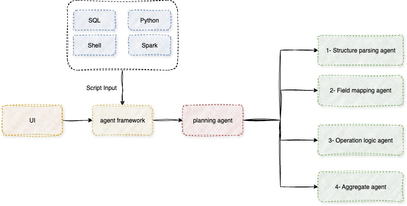

# Lineagent
Lineagent is an agentic framework for data lineage extraction across various data processing script types and export the results in OpenLineage format.

# architecture

Following is the architecture of how agentic chain of thought systems designed to extract lineage across various data processing script types.

## agent framework 
The agent framework dose IO operations ,memory management, and prompt engineering according to the script type (T) and its content (C).

$$
P := f(T, C)
$$

## planning agent

The planning agent orchestrates the execution of the prompt provided by the agent framework (P) by selecting the appropriate agent (A) and its corresponding task (T).

$$
G=h([\{(A_1, T_1), (A_2, T_2), (A_3, T_3), (A_4, T_4)\}],P)
$$

## Syntax Analysis Agent

Syntax Analysis agent, analyzes the syntactic structure of the raw script to identify subqueries and nested structures and decompose the script into multiple subscripts.

$$
\{sa1,⋯,san\}:=h([A_1,T_1],P)
$$

## Field Derivation Agent
The Field Derivation agent processes each subscript from syntax analysis agent to derive field-level mapping relationships and processing logic. 

$$
\{fd1,⋯,fdn\}:=h([A_2,T_2],\{sa1,⋯,san\})
$$

## Operation Tracing Agent
The Operation Tracing agent analyzes the complex conditions within each subscript identified in syntax analysis agent including filter conditions, join conditions, grouping conditions, and sorting conditions.

$$
\{ot1,⋯,otn\}:=h([A_3,T_3],\{sa1,⋯,san\})
$$

## Event Composer Agent
The Event Composer agent consolidates the results from the syntax analysis agent, the field derivation agent and the operation tracing agent to generate the final lineage result.

$$
\{A\}:=h([A_4,T_4],\{sa1,⋯,san\},\{fd1,⋯,fdn\},\{ot1,⋯,otn\})
$$