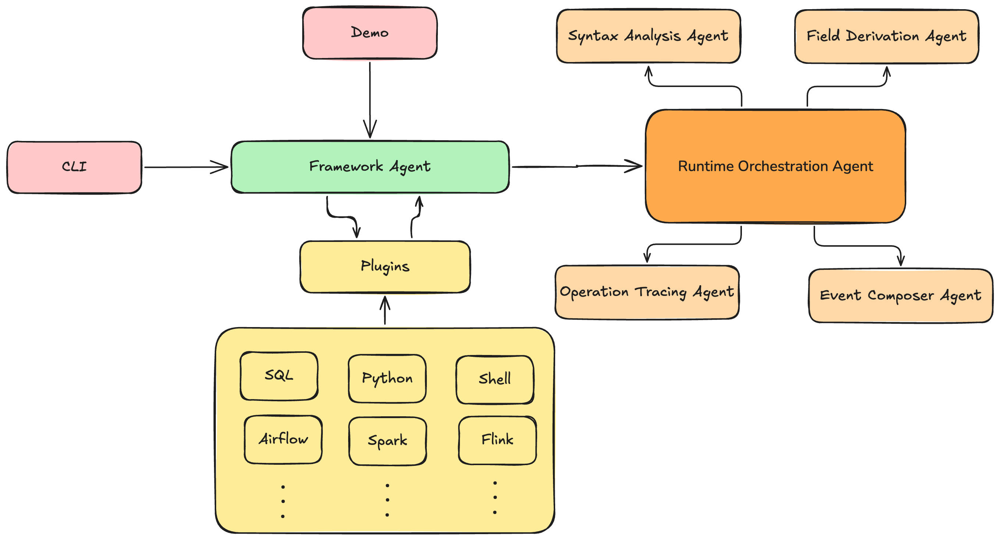

<div align="center">
  
</div>

## Lineagentic

Lineagentic is an agentic ai solution for building end-to-end data lineage across diverse types of data processing scripts across different platforms. It is designed to be modular and customizable, and can be extended to support new data processing script types.

### Features

- Plugin based architecture, simple to extend and customize.
- Interactive web lineage visualizer for development and debugging.
- Command line interface.
- Rest API for integration with other systems.
- Support for multiple data processing script types (SQL, Python, Airflow, etc.)

## Agent Status Table

Following table shows the current development agents in Lineagentic algorithm:


| **Agent Name**       | **Done** | **Under Development** | **In Backlog** | **Comment**                          |
|----------------------|:--------:|:----------------------:|:--------------:|--------------------------------------|
| python-lineeage_agent    | ✓        |                        |                |       |
| airflow_lineeage_agent       |    ✓        |                      |                |             |
| java_lineeage_agent      |       ✓     |                        |              |           |
| spark_lineeage_agent        |  ✓          |                       |                |       |
| sql_lineeage_agent      | ✓        |                        |                |            |
| flink_lineeage_agent         |          |                        | ✓              |            |
| beam_lineeage_agent         |          |                        | ✓              |            |
| shell_lineeage_agent         |          |                        | ✓              |            |
| scala_lineeage_agent         |          |                        | ✓              |            |
| dbt_lineeage_agent         |          |                        | ✓              |            |


### What are the components of Lineagentic?

- Algorithm module: This is the core component where all computations take place. It contains agents, implemented as plugins, that function as lineage extractors. The module is built using a plugin-based design pattern, allowing you to easily develop and integrate your own custom agents. Once added to the algorithm module, all other components of the platform will be available to support your agents

- Backend module: This module provides a REST API interface around the Algorithm Module. It exposes several REST endpoints, each tailored to specific tasks. Depending on the job requested, different agents within the Algorithm Module are activated accordingly.

- Lineage visualizer module: 
    This module provides a web-based interface for visualizing lineage data generated by various agents.

      1- Currently, it is primarily intended for developers and offers an interactive visualization using a JSONCrack-based interface.

      2- It includes a watchdog component that monitors JSON dumps produced by each agent, located in the lineage_extraction_dumps directory.

      3- The module also contains an end-to-end lineage builder, which aggregates and connects the individual agent outputs to construct a complete end-to-end lineage view.

- CLI module: is for command line around algorithm API.

- Demo module: is for teams who want to demo Lineagentic in fast and simple way deployable into huggingface spaces.


### Activation and Deployment

To simplify the usage of Lineagentic, a Makefile has been created to manage various activation and deployment tasks. You can explore the available targets directly within the Makefile. Here you can find different strategies but for more details look into Makefile.

1- to start the cli,api server, lineage visualizer, watchdog and demo server, run the following command:

```bash
make start-cli-api-server-with-lineage-visualizer-and-watchdog-and-demo-server
```
2- to start the cli, api server, lineage visualizer and watchdog, run the following command:

```bash
make start-cli-api-server-with-lineage-visualizer-and-watchdog
```
3- to start the cli, ßapi server, run the following command:

```bash
make start-cli-api-server
```

4- In order to deploy Lineagentic to Hugging Face Spaces, run the following command ( you need to have huggingface account and put secret keys there if you are going to use paid models):

```bash
make gradio-deploy
```

#### Command Line Interface (CLI)

Lineagentic provides a powerful CLI tool for quick analysis:

```bash
# List available agents
lineagentic --list-agents

# List supported operations
lineagentic --list-operations

# Analyze Airflow DAG
lineagentic --agent-name airflow-lineage-agent --query "your airflow code here"

# Analyze SQL query
lineagentic --agent-name sql-lineage-agent --query "SELECT * FROM table"

# Analyze Python script
lineagentic --agent-name python-lineage-agent --query "import pandas as pd; df = pd.read_csv('file.csv')"

# Use operation-based analysis (auto-selects appropriate agent)
lineagentic --operation lineage_analysis --query "your code here"

# Analyze code from file
lineagentic --agent-name airflow-lineage-agent --query-file path/to/your/script.py

# Save results to file
lineagentic --agent-name sql-lineage-agent --query "your sql" --output results.json --pretty
```

For more CLI options, see the [CLI documentation](cli/README.md).


### environment variables

- HF_TOKEN   (HUGGINGFACE_TOKEN)
- OPENAI_API_KEY


### Mathematic behind algorithm 


### Algorithm Architecture

The following figure illustrates the architecture behind the algorithm, which is essentially an agentic AI system that leverages a chain-of-thought process to construct lineage across various script types.



### agent framework 
The agent framework dose IO operations ,memory management, and prompt engineering according to the script type (T) and its content (C).

$$
P := f(T, C)
$$

## Runtime orchestration agent

The runtime orchestration agent orchestrates the execution of the required agents provided by the agent framework (P) by selecting the appropriate agent (A) and its corresponding task (T).

$$
G=h([\{(A_1, T_1), (A_2, T_2), (A_3, T_3), (A_4, T_4)\}],P)
$$

## Syntax Analysis Agent

Syntax Analysis agent, analyzes the syntactic structure of the raw script to identify subqueries and nested structures and decompose the script into multiple subscripts.

$$
\{sa1,⋯,san\}:=h([A_1,T_1],P)
$$

## Field Derivation Agent
The Field Derivation agent processes each subscript from syntax analysis agent to derive field-level mapping relationships and processing logic. 

$$
\{fd1,⋯,fdn\}:=h([A_2,T_2],\{sa1,⋯,san\})
$$

## Operation Tracing Agent
The Operation Tracing agent analyzes the complex conditions within each subscript identified in syntax analysis agent including filter conditions, join conditions, grouping conditions, and sorting conditions.

$$
\{ot1,⋯,otn\}:=h([A_3,T_3],\{sa1,⋯,san\})
$$

## Event Composer Agent
The Event Composer agent consolidates the results from the syntax analysis agent, the field derivation agent and the operation tracing agent to generate the final lineage result.

$$
\{A\}:=h([A_4,T_4],\{sa1,⋯,san\},\{fd1,⋯,fdn\},\{ot1,⋯,otn\})
$$


